# 🚦 UK Road Accident Severity Analysis

<div align="center">

**An End-to-End Data Analytics Pipeline | Python • PostgreSQL • Power BI**

[](https://www.python.org/)
[](https://www.postgresql.org/)
[](https://powerbi.microsoft.com/)
[](LICENSE)

*Analyzing 1.5M+ UK Road Accidents (2005–2015) to identify risk factors, hotspots, and severity patterns*

</div>

---

## 📋 Table of Contents

- [Project Overview](#-project-overview)
- [Architecture & Data Pipeline](#-architecture--data-pipeline)
- [Tech Stack](#-tech-stack)
- [Dataset Description](#-dataset-description)
- [Project Workflow](#-project-workflow)
- [Key Features](#-key-features)
- [Installation & Setup](#-installation--setup)
- [Usage](#-usage)
- [SQL Analytics](#-sql-analytics)
- [Power BI Dashboard](#-power-bi-dashboard)
- [Insights & Findings](#-insights--findings)
- [Project Structure](#-project-structure)
- [Future Enhancements](#-future-enhancements)
- [Contributing](#-contributing)
- [License](#-license)

---

## 🎯 Project Overview

This project is a comprehensive **end-to-end data analytics pipeline** that analyzes UK Road Accidents from 2005 to 2015. The pipeline processes **1.5+ million accident records** through multiple stages:

1. **Data Cleaning & EDA** with Python (Pandas, Matplotlib/Seaborn)
2. **Data Storage & Advanced Analytics** using PostgreSQL
3. **Interactive Visualization** with Power BI dashboards

The project identifies **accident hotspots**, **risk factors**, **severity patterns**, and **seasonal trends** to provide actionable insights for road safety improvement.

---

## 🏗 Architecture & Data Pipeline

```mermaid
graph TB
    A[📥 Raw Dataset<br/>UK Road Accidents<br/>2005-2015] --> B[🐍 Python ETL Script]
    
    B --> C[🧹 Data Cleaning]
    C --> C1[Remove Irrelevant Columns]
    C --> C2[Handle Missing Values]
    C --> C3[Convert Data Types]
    C --> C4[Create Derived Features]
    
    C --> D[🔍 Exploratory Data Analysis]
    D --> D1[Visualizations]
    D --> D2[Statistical Analysis]
    D --> D3[Pattern Discovery]
    
    D --> E[💾 PostgreSQL Database]
    E --> E1[Staging Table<br/>accidents_raw]
    E1 --> E2[Final Table<br/>accidents_pbi]
    
    E2 --> F[🔎 SQL Analytics]
    F --> F1[15 Advanced Queries]
    F --> F2[Hotspot Analysis]
    F --> F3[Severity Patterns]
    
    E2 --> G[📊 Power BI Dashboard]
    G --> G1[Overview Page]
    G --> G2[Time Analysis]
    G --> G3[Geospatial Hotspots]
    G --> G4[Road & Weather Impact]
    
    G --> H[💡 Business Insights]
    
    style A fill:#e1f5ff
    style B fill:#fff4e1
    style E fill:#e8f5e9
    style G fill:#fce4ec
    style H fill:#f3e5f5
```



---

## 🛠 Tech Stack

| Layer | Technology | Purpose |
|-------|-----------|---------|
| **Data Processing** | Python 3.8+ | Data cleaning, transformation, and EDA |
| **Data Analysis** | Pandas, NumPy | Data manipulation and analysis |
| **Visualization** | Matplotlib, Seaborn | Exploratory data visualization |
| **Database** | PostgreSQL 12+ | Data storage and advanced SQL analytics |
| **ETL** | Python (psycopg2/pandas) | Data extraction, transformation, and loading |
| **Business Intelligence** | Power BI | Interactive dashboards and reporting |
| **Version Control** | Git, GitHub | Source code management |

---

## 📊 Dataset Description

### Dataset Statistics
- **Total Records**: ~1.5 million accident records
- **Time Period**: 2005–2015
- **Geographic Coverage**: United Kingdom
- **Dimensions**: 30+ attributes per record

### Key Columns

| Category | Fields | Description |
|----------|--------|-------------|
| **Identifiers** | `Accident_Index` | Unique accident identifier |
| **Temporal** | `Date`, `Time`, `Hour` | Date and time of accident |
| | `Month`, `Weekday`, `Day` | Derived temporal features |
| | `Time_of_Day` | Morning/Afternoon/Evening/Night |
| **Severity** | `Accident_Severity` | 1 = Fatal, 2 = Serious, 3 = Slight |
| **Location** | `Latitude`, `Longitude` | Geographic coordinates |
| | `Local_Authority_District` | Administrative district |
| | `Urban_or_Rural_Area` | Urban/Rural classification |
| **Environmental** | `Weather_Conditions` | Weather at time of accident |
| | `Light_Conditions` | Lighting conditions |
| **Road** | `Road_Type` | Type of road |
| | `Speed_limit` | Posted speed limit (mph) |

### Engineered Features

```python
# Temporal Features
Month, Weekday, Day, Hour
Time_of_Day (Morning / Afternoon / Evening / Night)

# Data Quality
Missing value indicators
Invalid data flags
```

---

## 📈 Project Workflow


---

## ✨ Key Features

### 🧹 Data Cleaning Pipeline

- ✅ **Column Removal**: Dropped irrelevant and 90%+ null columns
  - `Unnamed: 0`, `Special_Conditions_at_Site`, `Carriageway_Hazards`
- ✅ **Missing Value Handling**:
  - Time conversion to valid HH:MM format
  - Location fields converted to float
  - Invalid values (`""`, `"Unknown"`, `"?"`) → `NaN`
- ✅ **Data Type Conversion**:
  ```python
  df['Date'] = pd.to_datetime(df['Date'], format="%d-%m-%Y")
  df['Hour'] = df['Time'].apply(extract_hour)
  ```
- ✅ **Feature Engineering**:
  - Month, Day, Weekday extraction
  - Time_of_Day categorization

### 🔍 Exploratory Data Analysis


#### Analysis Highlights:

1. **Severity Distribution**
   - Slight accidents = majority
   - Fatal accidents form ~2–3% of total
   
2. **Temporal Patterns**
   - **Peak Hours**: 17:00, 18:00 (evening rush hour)
   - **Peak Day**: Friday
   - **Seasonal Spike**: November–December (winter)
   
3. **Weather Impact**
   - Highest accidents: Fine weather (more vehicles)
   - Highest fatality rate: Fog, Rain, Snow
   
4. **Location Analysis**
   - Urban areas = more crashes
   - Rural areas = more fatal crashes (high speed, low lighting)
   - Hotspots: London, Birmingham, Manchester

---

## 🚀 Installation & Setup

### Prerequisites

- Python 3.8 or higher
- PostgreSQL 12 or higher
- Power BI Desktop (for dashboard)
- Git (for version control)

### Step 1: Clone Repository

```bash
git clone https://github.com/yourusername/uk-road-accident-analysis.git
cd uk-road-accident-analysis
```

### Step 2: Install Python Dependencies

```bash
# Create virtual environment (recommended)
python -m venv venv

# Activate virtual environment
# On Windows:
venv\Scripts\activate
# On macOS/Linux:
source venv/bin/activate

# Install required packages
pip install -r requirements.txt
```

### Step 3: Setup PostgreSQL Database

```sql
-- Create database
CREATE DATABASE road_accidents_db;

-- Connect to database
\c road_accidents_db;

-- Run schema creation script
\i scripts/create_schema.sql
```

### Step 4: Configure Database Connection

Create a `config.py` file (or use environment variables):

```python
DATABASE_CONFIG = {
    'host': 'localhost',
    'database': 'road_accidents_db',
    'user': 'your_username',
    'password': 'your_password',
    'port': 5432
}
```

### Step 5: Run ETL Pipeline

```bash
# Run data cleaning and loading
python scripts/data_cleaning.py
python scripts/load_to_postgres.py
```

---

## 📖 Usage

### Data Cleaning Script

```bash
python scripts/data_cleaning.py --input data/raw/accidents.csv --output data/cleaned/accidents_cleaned.csv
```

### EDA Script

```bash
python scripts/exploratory_analysis.py --input data/cleaned/accidents_cleaned.csv
```

### SQL Analytics

```bash
# Connect to PostgreSQL and run queries
psql -d road_accidents_db -f sql_queries/01_severity_distribution.sql
```

### Power BI Dashboard

1. Open `dashboard/Road_Accidents_Dashboard.pbix` in Power BI Desktop
2. Update data source connection if needed
3. Refresh data and explore interactive visualizations

---

## 🔎 SQL Analytics

The project includes **15 advanced SQL queries** covering:


### Example Query: Severity Distribution

```sql
SELECT 
    CASE "Accident_Severity"
        WHEN 1 THEN 'Fatal'
        WHEN 2 THEN 'Serious'
        WHEN 3 THEN 'Slight'
    END AS severity_label,
    COUNT(*) AS accident_count,
    ROUND(COUNT(*) * 100.0 / SUM(COUNT(*)) OVER (), 2) AS percentage
FROM accidents_pbi
GROUP BY "Accident_Severity"
ORDER BY "Accident_Severity";
```

### Query Categories:

1. **Severity Analysis** (3 queries)
   - Overall distribution
   - Fatality rate by factors
   - Severity trends over time

2. **Temporal Analysis** (4 queries)
   - Hourly accident patterns
   - Day of week trends
   - Monthly and yearly comparisons
   - Time-of-day risk analysis

3. **Geographic Analysis** (3 queries)
   - Top dangerous districts
   - Accident hotspot grids
   - Urban vs Rural comparison

4. **Environmental Factors** (3 queries)
   - Weather condition impact
   - Light condition analysis
   - Seasonal patterns

5. **Road Infrastructure** (2 queries)
   - Speed limit fatality rates
   - Road type severity patterns

---

## 📊 Power BI Dashboard

### Dashboard Structure


### Key DAX Measures

```dax
// Total Accidents
Total Accidents := COUNTROWS(accidents_pbi)

// Fatal Accident Percentage
Fatal % :=
DIVIDE(
    CALCULATE(
        [Total Accidents],
        accidents_pbi[Accident_Severity] = 1
    ),
    [Total Accidents],
    0
) * 100

// Average Accidents per Hour
Avg Accidents per Hour :=
DIVIDE(
    [Total Accidents],
    DISTINCTCOUNT(accidents_pbi[Hour])
)

// Year-over-Year Growth
YoY Growth % :=
VAR CurrentYear = [Total Accidents]
VAR PreviousYear =
    CALCULATE(
        [Total Accidents],
        SAMEPERIODLASTYEAR(accidents_pbi[Date])
    )
RETURN
    DIVIDE(CurrentYear - PreviousYear, PreviousYear, 0) * 100
```

### Visualizations Included

- **KPI Cards**: Total accidents, fatality rate, YoY change
- **Charts**: Bar, line, pie, donut, treemap
- **Maps**: UK geographic heat map with accident density
- **Tables**: Top districts, time patterns, weather impact
- **Filters**: Date range, severity, location, weather

---

## 💡 Insights & Findings

### Critical Discoveries


### Detailed Findings

| Category | Insight | Impact |
|----------|---------|--------|
| **Temporal** | Evening peak hours (17:00–18:00) show maximum collisions | Focus traffic management during rush hours |
| **Geography** | Rural roads show higher fatality rate despite fewer accidents | High speed + low lighting = deadly combination |
| **Infrastructure** | Dark roads with no lighting → higher fatal crashes | Infrastructure investment priority |
| **Weather** | Rain/Fog/Snow conditions significantly increase severity | Weather-based alert systems needed |
| **Seasonal** | November–December shows accident spike due to winter | Seasonal safety campaigns |
| **Location** | Major city areas have highest accident density | Urban planning and traffic management |

---

## 📁 Project Structure

```
uk-road-accident-analysis/
│
├── 📂 data/
│   ├── raw/                    # Original dataset
│   ├── cleaned/                # Processed data
│   └── external/               # Reference data
│
├── 📂 scripts/
│   ├── data_cleaning.py        # Data cleaning pipeline
│   ├── exploratory_analysis.py # EDA scripts
│   ├── load_to_postgres.py     # ETL to PostgreSQL
│   └── utils.py                # Helper functions
│
├── 📂 sql_queries/
│   ├── 01_severity_distribution.sql
│   ├── 02_hourly_patterns.sql
│   ├── 03_weather_impact.sql
│   └── ...                     # 15 total queries
│
├── 📂 dashboard/
│   └── Road_Accidents_Dashboard.pbix
│
├── 📂 notebooks/
│   └── EDA_Analysis.ipynb      # Jupyter notebook for EDA
│
├── 📂 docs/
│   ├── database_schema.md      # Database documentation
│   └── dashboard_guide.md      # Power BI usage guide
│
├── 📂 tests/
│   └── test_data_cleaning.py   # Unit tests
│
├── .gitignore
├── requirements.txt            # Python dependencies
├── README.md                   # This file
└── LICENSE
```

---

## 🔮 Future Enhancements


### Planned Features

1. **Machine Learning Models**
   - Accident severity prediction (Logistic Regression, Random Forest)
   - Hotspot prediction using clustering (K-Means, DBSCAN)
   - Risk scoring model for road segments

2. **Advanced Analytics**
   - Time series forecasting for accident trends
   - Spatial analysis with advanced clustering algorithms
   - Anomaly detection for unusual patterns

3. **Real-time Capabilities**
   - Real-time road safety alert dashboard
   - Live data streaming integration
   - Automated alert system for high-risk conditions

4. **Enhanced Integration**
   - OpenStreetMap for better geospatial visualization
   - Weather API integration for real-time conditions
   - Traffic data APIs for comprehensive analysis

---

## 🎓 Learning Outcomes

This project demonstrates proficiency in:

- ✅ **Data Engineering**: ETL pipeline design and implementation
- ✅ **Data Analysis**: Statistical analysis and pattern recognition
- ✅ **Database Management**: Advanced SQL queries and optimization
- ✅ **Business Intelligence**: Dashboard design and DAX measures
- ✅ **Data Visualization**: Creating impactful visualizations
- ✅ **Problem Solving**: Identifying actionable insights from data

**Ideal for:**
- Portfolio projects
- Data Analyst / BI Engineer interviews
- Academic submissions
- Industry-standard analytics workflows

---

## 🤝 Contributing

Contributions are welcome! Please feel free to submit a Pull Request.

1. Fork the repository
2. Create your feature branch (`git checkout -b feature/AmazingFeature`)
3. Commit your changes (`git commit -m 'Add some AmazingFeature'`)
4. Push to the branch (`git push origin feature/AmazingFeature`)
5. Open a Pull Request

---

## 📄 License

This project is licensed under the MIT License - see the [LICENSE](LICENSE) file for details.

---

## 👤 Author


- GitHub:@shyam20433(https://github.com/shyam20433)
- LinkedIn: [[Your Profile](https://linkedin.com/in/yourprofile)](https://www.linkedin.com/in/shyamsundar-s-s-80117931a/)
- Email: shyamsundar93424@gmail.com

---

## 🙏 Acknowledgments

- UK Department for Transport for providing the open dataset
- PostgreSQL community for excellent documentation
- Power BI team for powerful visualization tools

---

<div align="center">

**⭐ If you found this project helpful, please give it a star! ⭐**


</div>

